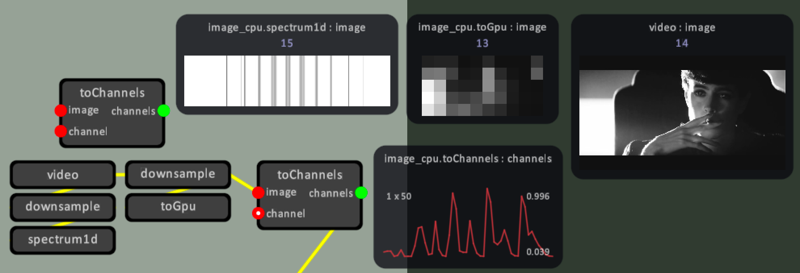

[](https://travis-ci.com/github/marcel303/framework)
[](https://ci.appveyor.com/project/MarcelSmit/framework)

(Building a creative coding environment from scratch is a ton of work, so please consider becoming a patron!)
<br />[](https://www.patreon.com/marcelsmit)

# README #

Hi! This is the origin of the Framework creative coding library.

## A creative coding library ##

Framework is a creative coding library developed in C++. It includes support for drawing images and playing sounds with one line of code, facilitating very rapid prototyping during creative code jams or workshops. It also includes easy access to keyboard, mouse and up to four gamepads. Shader programming is easy using the Shader class. All resources (images, sounds, shaders and more) can be tracked in real-time and hot-reloaded when changed.

In addition to the library itself, the code available here also includes a few side-projects built using Framework, including `audiograph` and `vfxgraph`. `audiograph` is a node based sound synthesis library and editor, while `vfxgraph` is intended for visuals and control. Both are built on top of `avgraph`, which provides a node based editor similar to VVVV and TouchDesigner.

## Design philosophy ##

The philosophy behind the design of Framework is that it should be fun to do coding!

As such, its language tries to be pragmatic and sparse, optimized for expression. The build system makes it easy to add apps and libraries and distribute packages. Code longevity is extended through a careful design of its vocabulary, slowly accumulating new functionality over time as it is needed. Build-times are kept low (usually a second or less) through careful monitoring and optimization of build times. Iteration is kept fast, through hot-reloading of resources when they are changed, and by delaying loading resources at startup until they are used (with full resource pre-loading being available for distributing builds).

## Features ##

- Multiple windows, keyboard, mouse and gamepads available everywhere. No callbacks needed,
- Hot-reloading of textures, models, shaders, or your own resources,
- Text drawing routines (SDF fonts or bitmapped),
- GX drawing api with backend implementations for OpenGL and Metal,
- GX immediate mode api. This api is similar in design to the legacy OpenGL interface for drawing primitives (gxBegin, gxEnd, gxVertex2f, etc). This api is intended for rapidly prototyping visuals,
- GX mesh api, using vertex and index buffers. This api allows for high-performance graphics, but is more rigid in nature than the immediate mode api,
- High quality primitive drawing, using signed distance fields for edge anti-aliasing,
- Surface class for easily drawing to textures, with built-in support for double buffering and post-processing,
- Render passes api with support for multiple render targets (mrt),
- Support for custom shader output semantics to aid development of shaders for use with mrt,
- GX capture api, for capturing GX immediate mode drawing into a GxMesh,
- Built-in shaders for hard and soft skinning, gaussian blurs, and more,
- Sprites and Spriter animations,
- FBX and glTF model loading and drawing,
- Stereo sound output, OGG/vorbis loading and streaming,
- Build system designed to make happy, not sad.

## Getting started ##

In summary,

- Clone the `framework` repository,
- Clone the submodules of the `framework` repository,
- Create a 'chibi root' file, and let it point to both the 'framework' repository and your own repository(s),
- Generate the project file.

Step by step:

```
cd ~
git clone https://github.com/marcel303/framework
git clone https://github.com/<your-account>/<your-project>
```

Clone `framework` submodules,

```
cd ~
cd framework
git submodule update --init --recursive
```

Create a text file named `chibi-root.txt` with the following contents,

```
cd ~
vim chibi-root.txt
```

```
add_root framework
```

This will create a chibi root file referencing the chibi root file in the `framework` repository.

Generate the project file,

On linux/macOS,

```
cd ~
cd framework
./generate.sh
```

On Windows,

```
cd framework
generate.bat
```

The project file generator should open Finder on macOS, with `Project.xcodeproj` focused, or Explorer on Windows, with `Project.sln` focused.

Open the generated project file in your favourite ide. To run one of the example apps, select the target and build and run it.

### Using framework within your own projects
To use `framework` within your own apps, you will need to,

- Create a folder and a `chibi.txt` file for your app(s),
- Add your chibi file to the chibi root,
- Add one or more apps to your chibi file, and depend on the framework library,
- Generate the project file.

Step by step:

Create a folder and a `chibi.txt` file,

```
cd ~
mkdir myapp
```

Create a `chibi.txt` file within the `myapp` folder with the following contents,

```
cd myapp
vim chibi.txt
```

```
app myapp
	depend_library framework
	add_files main.cpp
```

Create a `main.cpp` file,

```
#include "framework.h"

int main(int argc, char * argv[])
{
	setupPaths(CHIBI_RESOURCE_PATHS);
	
	if (!framework.init(800, 600))
		return -1;

	for (;;)
	{
		framework.process();

		if (framework.quitRequested)
			break;

		framework.beginDraw(0, 0, 0, 0);
		{
			setColor(colorWhite);
			drawRect(100, 100, 200, 200);
		}
		framework.endDraw();
	}

	framework.shutdown();
}
```

Add your chibi file to `chibi-root.txt`,

```
cd ~
vim chibi-root.txt
```

```
add_root framework
add myapp
```

Generate the project file,

```
cd ~
cd framework
./generate.sh myapp
```

Note that the target to generate the project file for is set to `myapp`. This will generate a project file tailored to build and run `myapp` only. If you want to add more targets to your project file, that's possible too. Just append the targets you want to generate to the command line.

For instance,

```
./generate.sh myapp vfxgraph-*
```

Note that the wildcard `*` means we will generate all of the libraries and apps with a name starting with `vfxgraph-`. These are all of the vfxgraph library example apps.

### Marcel's user apps ###

There's a few user-contributed apps and libraries inside the `users/marcel` folder. The chibi root file for these projects isn't hooked up by default. You can add `users/marcel/chibi-root.txt` to your root file and generate these apps and libraries. This folder is where I develop new ideas, and add prototypes for libraries, that may eventually be included in a next version of framework.

## What else is included? ##

### Framework libraries ###

- **avgraph** Reusable graph editor with real-time editing support,
- **audiograph** Graph-based system for real-time audio synthesis,
- **gltf** glTF model loading and drawing. Includes pbr shaders,
- **libreflection** Low-overhead reflection library,
- **libreflection-jsonio** json read-write for reflected types,
- **libreflection-textio** text read-write for reflected types,
- **fluidCube** 2d and 3d fluid dynamics (cpu and gpu),
- **libfbx** Speedy fbx parsing library,
- **libosc** OSC endpoints and threaded message handling, built on top of liboscpack,
- **libvideo** Threaded video decoding using libavcodec (ffmpeg),
- **libwebrequest** Perform web requests and download files using a download cache.

### Framework integration libraries ###

Framework includes a few 3rd party library integrations out of the box, including,

- **imgui-framework** Quickly add user interfaces to your projects using ImGui,
- **nanovg-framework** Draw antialiased paths using the gpu with NanoVG,
- **nanovg-canvas** Provides a canvas api on top of nanovg-framework,
- **jsusfx-framework** Provides Framework implementations for jsusfx's file and graphics apis, enabling jsusfx dsp effects to be run within the context of a Framework app,
- **jsusfx-audiograph** jsusfx audio nodes for audiograph,
- **jgmod-audiograph** jgmod audio nodes for audiograph.

### Third party libraries ###

This is a list of libraries made readily available through this repository.

- **box2d** Add real-time 2d physics to your apps,
- **libetherdream** Control laser projectors using the Etherdream controller,
- **leapmotion** Track hands and fingers using the Leap Motion controller,
- **libfreenect2** (macOS only) Receive depth and color images from Kinect v2 sensors,
- **PS3EYEDriver** Connect PS3 eye cameras through usb and receive camera and microphone streams into your apps,
- **Syphon** (macOS only) Share your visuals with other applications,
- **DeepBelief** (macOS only) Use machine learning to classify images,
- **rapidjson** Parse and write json documents,
- **tinyxml2** Parse and write xml documents,
- **portaudio** Multichannel audio input and output,
- **rtmidi** Cross-platform midi input and output,
- **nfd** Native file dialog library,
- **oscpack** Send and receive OSC messages, to let your app communicate with the outside world,
- **jsusfx** Jesusonic scripting language and framework for creating dsp plugins for the Reaper digital audio workstation (daw),
- **FreeImage** Load and save most image formats,
- **freetype2** Load and render glyphs for many font formats,
- **libsdl2** Create SDL2 applications (or let Framework manage things for you),
- **msdfgen** Create MSDF signed distance fields from paths,
- **oggvorbis** Read and write ogg/vorbis files,
- **turbojpeg** Fast jpeg encoding and decoding library,
- **libjgmod** A relic from the past! Plays xm, mod, s3m and (many) it files,
- **utf8rewind** Full-featured utf8 library,
- **xmm** Use various classifiers to identify and track gestures.


## `vfxgraph` Node based visuals and control ##

* `vfxgraph` is a visual node based system, adopting the data-flow paradigm to programming.
* `vfxgraph` makes it easy to add new node types by either hand-crafting a types.xml file, or by defining them in code.
* The environment allows one to inspect and preview any input or output socket. Persistent socket value visualizers can be added by right clicking on a socket.
* Graph changes are applied in real-time and previewed behind the editor, providing immediate visual feedback of the work you are doing.



## `audiograph` Sound synthesis and performance demo ##

* `4dworld` is a sound synthesis and performance tool, using the graph editor included with `avgraph` to modularly design sounds and effects.
* `4dworld` includes an audio synthesis backend which makes it easy to experiment with sound design in real-time. It extends real-time editing by propagating changes to all instances of a graph.
* This demo app shows how to create multiple instances from one graph. Each bird and machine uses its own `audiograph` instance for its sound synthesis.

## Contacting the author ##

For questions or suggestions, send me an e-mail at marcel303 [at] gmail.com, or reach out to me on Github.
