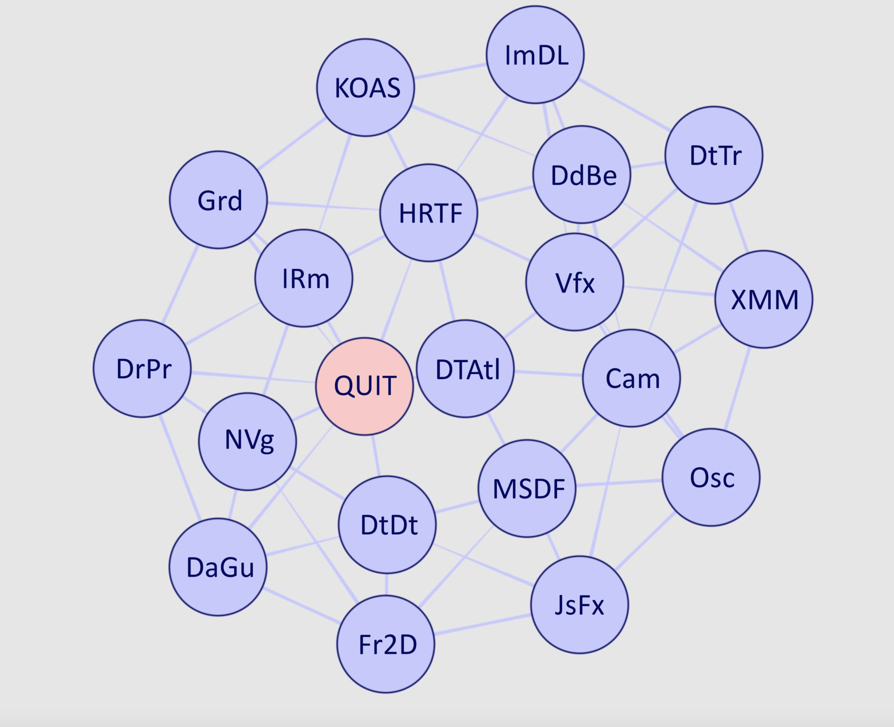
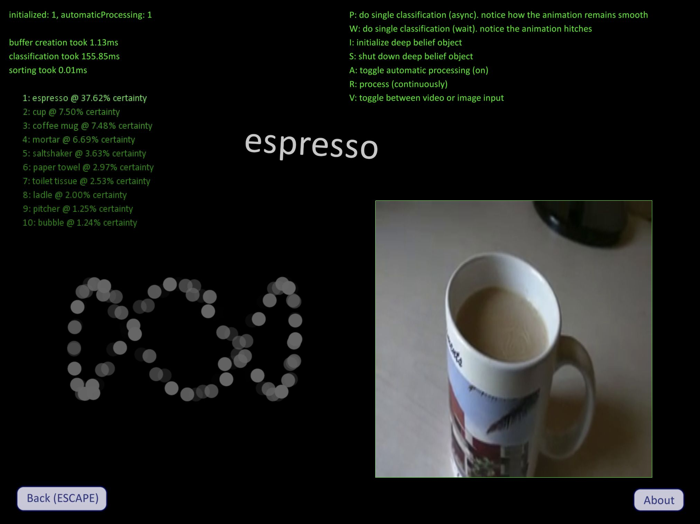

# Readme
The test app serves as a test bed for ideas. Many contributions to `framework` and its first-party libraries originate from here. Most tests present an interactive visual interface, allowing one to play around with the idea or algorithm under development.

Some ideas developed with the test app,

* Dynamic GPU-based texture atlas
* `NanoVG` framework integration
* Binaural (HRTF) audio DSP
* PS3 EYE camera integration
* `framework` HQ primitive drawing
* Prototype for a blob detection algorithm
* Prototype for a dot detection algorithm
* `vfxgraph` visual and control graph system
* `audiograph` audio graph system

